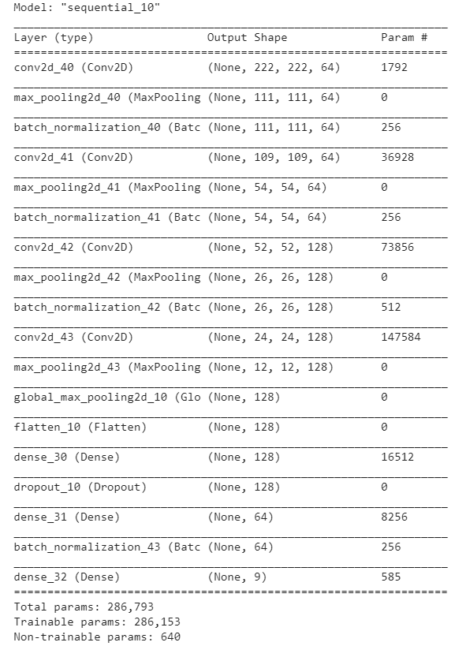

# ECE-884-group6

# 1.Introduction

## 1.1 Background
Robotic weed/plant control, which is to use a camera-based machine vision system to detect crop plants and weeds. It helps to reduce both the labor cost and herbicide usage. The ability to conduct fast and accurate method in differentiating weed and corp seedlings can help farmers to efficiently maintain environment of farm. 

## 1.2 Dataset
Two good examples of such application are _DeepWeeds_ and _Plant seedlings_.

The `DeepWeeds` is a balanced dataset (_https://www.tensorflow.org/datasets/catalog/deep_weeds_) that has 17,509 labelled images of 8 nationally significant weed species native to 8 locations across northern Australia. 

`Plant seedlings` is a unbalanced dataset (_https://www.kaggle.com/c/plant-seedlings-classification_) including images of approximately 960 unique plants belonging to 12 species at several growth stages (4750 images in total). 

## 1.3 Analysis of _Plant seedlings_
### 1.3.1 Exploratory analysis
The original 4750 images was randomly splitted into train and test set with ratio 8:2. Test set was  We preprocess the training set images by resizing (150 x 150), masking, transforming to greyscale and feature standardization. By using PCA, each image was transformed to a 180-dim array, which was further reduced to 2D plot using t-SNE with parameter `perplexity=30` and can be visualized as below

From the resulting plot above, it can be observed that train set images with 12 labels are well mixed and hard to differentiate by simply projecting images to low dimension space.

### 1.3.2 Oversampling minority classes
Below is the plot of sample sizes of all 12 classes

It can be observed from the plot that the dataset is unbalanced. With more than 600 images in class _Loose silky bent_ while only around 200 images in classes such as _Malze_.

To overcome this unbalancing issue, we tried to balance the dataset by oversampling 40~60 images from minority classes (e.g. plant _Malze_) and apply each of the following image transformations:
- Keep only red channel
- Keep only green channel
- Keep only blue channel
- Unsharp

After oversampling, the dataset is balanced as shown below:

### 1.3.3 Data augmentation
Due to limited training set of only 3800 images, we decided to enlarge the dataset with augmented images. Therefore, following the _Oversampling_ step, the dataset was enlarged with augmented images acquired by randomly drawing 300 images from each class and randomly apply one of the following transformations:
- Rotation
- Flip
- Add Gaussian noise

### 1.3.4 Classifier
We build two image classifiers `CNN` and `Inception-ResNet v2` that can label various types of plant/weed images with the highest accuracy being 93.2%.

### 1.3.5 Result

The results show that classification accuracy of both CNN and inception-ResNetv2 decreased after applying data augmentation technique. The reason for this disappointing result is likely due to bias of augmented images, which could be possibly corrected by increase number of augmented images or using WeMix[1].

## 1.4 Analysis of _DeepWeed_
### 1.4.1 Exploratory analysis
The `DeepWeeds` data set has 9 Classes, including negatives. There are 10504 images for training, 3502 images for validation, and 3503 images for testing. The images was originally sized oiginally 256*256,during the training they are corped to 224*224, like what they did in the 'DeepWeeds' paper.
### 1.4.2 CNN set up
For the `CNN` classifier, it is seted up the same with the unbalanced data set. There are 100 epoch was done.
Below is the plot of sample sizes of all 12 classes

### 1.4.2 CNN result

# Usage

# References
[1] Xu. et al, “WeMix: How to Better Utilize Data Augmentation” arXiv:2010.01267 [cs], Oct. 2020.

